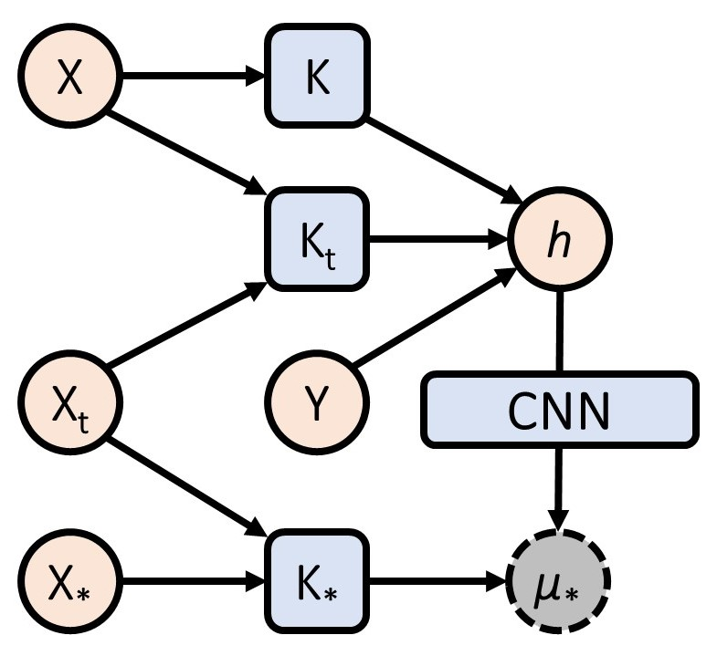
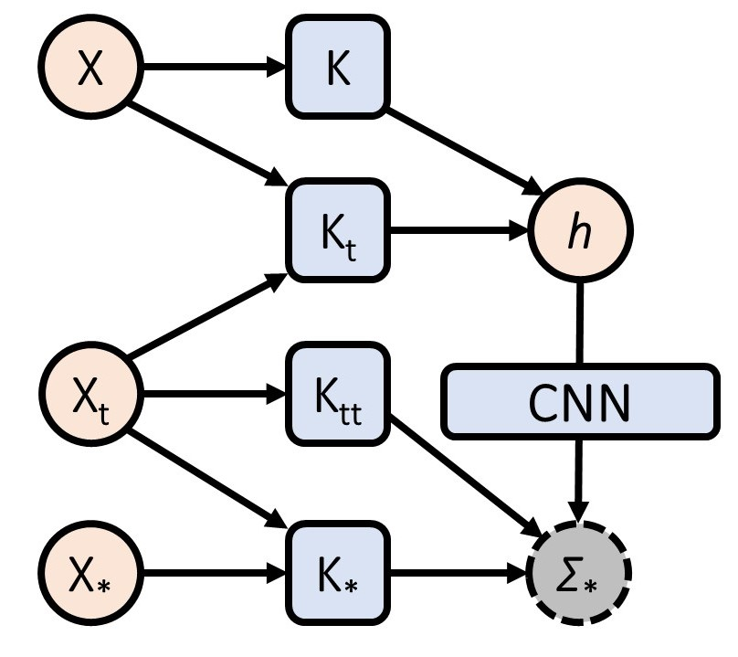

# NP-PROV: Neural Processes with Position-Relevant-Only Variances

This repository is the official implementation of [NP-PROV: Neural Processes with Position-Relevant-Only Variances](https://arxiv.org/abs/2030.12345). 

<p align="center">
 
</p>

## Requirements
* Python 3.6 or higher.

* `gcc` and `gfortran`:
    On OS X, these are both installed with `brew install gcc`.
    On Linux, `gcc` is most likely already available,
    and `gfortran` can be installed with `apt-get install gfortran`.
    

Install the requirements and You should now be ready togo!

```bash
pip install -r requirements.txt
```


## Training

To train the model(s) for off-the-grid datasets, run this command:

```train
python train_1d.py --name EQ --epochs 200 --learning_rate 3e-4 --weight_decay 1e-5
```

The first argument, `name`(`default = EQ`), specifies the data that the model will be trained
on, and should be one of the following:
 
* `EQ`: samples from a GP with an exponentiated quadratic (EQ) kernel;
* `matern`: samples from a GP with a Matern-5/2 kernel;
* `period`: samples from a GP with a weakly-periodic kernel


## Evaluation

To evaluate my model on ImageNet, run:

```eval
python eval.py --model-file mymodel.pth --benchmark imagenet
```

> 📋Describe how to evaluate the trained models on benchmarks reported in the paper, give commands that produce the results (section below).

## Pre-trained Models

You can download pretrained models here:

- [My awesome model](https://drive.google.com/mymodel.pth) trained on ImageNet using parameters x,y,z. 

> 📋Give a link to where/how the pretrained models can be downloaded and how they were trained (if applicable).  Alternatively you can have an additional column in your results table with a link to the models.

## Results

Our model achieves the following performance on :

### [Image Classification on ImageNet](https://paperswithcode.com/sota/image-classification-on-imagenet)

| Model name         | Top 1 Accuracy  | Top 5 Accuracy |
| ------------------ |---------------- | -------------- |
| My awesome model   |     85%         |      95%       |

> 📋Include a table of results from your paper, and link back to the leaderboard for clarity and context. If your main result is a figure, include that figure and link to the command or notebook to reproduce it. 


## Contributing

> 📋Pick a licence and describe how to contribute to your code repository. 